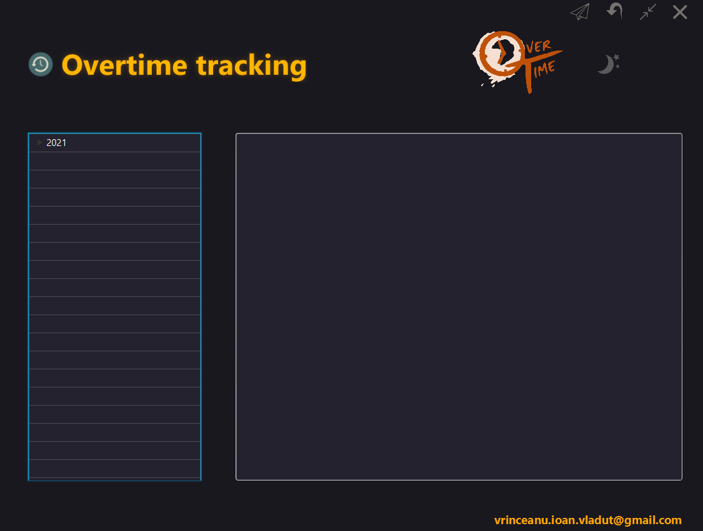
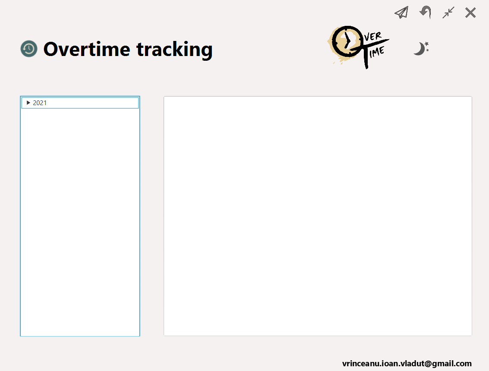
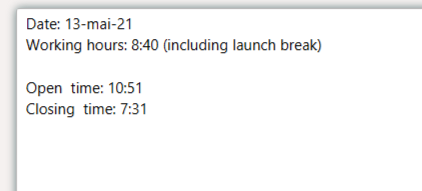
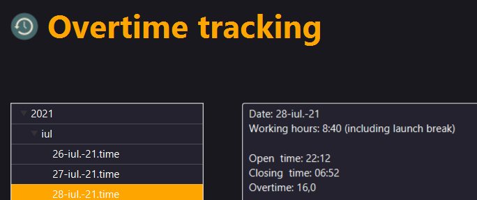
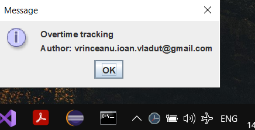

`Overtime`

Java application which help overtime tracking.

`1. Features:`
- black/white theme (frameless):

  

- create structure folder (year/month) & day-month-year.time file which contains Date, Working hours (8:40), Open time, Close time (Open time + Working hours):

  

- save configuration in config.ini file (theme & send e-mail option)

- background task calculating overtime:

  

- system tray available when program is running in background:

  

- beside folder structure with .time files total overtime is tracked also in excel file in the root folder configured at start when outlook e-mail function is enabled.

- sending outlook e-mail (at tray closing) by calling vba generated script (no access to microsoft api inside company) from overtime tracking excel when feature is enabled.

  
  
`2. How to:`
- open jar file with 2 parameters folder_root_path and e-mail:
eg. java -jar overtime.jar "D:\overtime" "vrinceanu.ioan.vladut@gmail.com"
  (batch file could be created to open application)  

